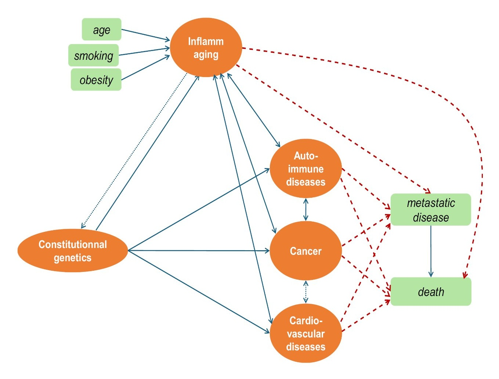

<div align="center">

# 🔬 multimorbidity-SEM

### Decoding Multimorbidity: Cancers, Cardiovascular & Inflammatory Chronic Diseases

[](https://choosealicense.com/licenses/gpl-3.0/)
[](https://www.python.org/)
[](https://www.stata.com/)
[]()
[](https://colab.research.google.com/github/MorillaLab/multimorbidity-SEM/blob/main/analysis/01_data_cleaning.ipynb)

**The first mathematical demonstration** of interconnected pathophysiological links between familial cardiovascular risk, inflammaging, cancer, and chronic inflammatory diseases — using Structural Equation Modelling on a 677-patient prospective cohort.

[📄 Paper](#-citation) · [🚀 Quick Start](#-quick-start) · [📊 Key Findings](#-key-findings) · [🏗️ Model](#️-sem-framework) · [🗂️ Data](#️-data-availability)

</div>

---

## 🔍 Overview

Multimorbidity — the co-occurrence of multiple chronic conditions — is one of the leading challenges in modern medicine. Yet the pathophysiological pathways linking cancers, cardiovascular disease, and inflammatory conditions remain poorly understood.

This study applies **Structural Equation Modelling (SEM)** to a prospective cohort of 677 cancer patients followed at Hôpital Avicenne (APHP, Paris) from 2016 to 2022. We construct and validate latent variables capturing *Inflammaging*, *Familial Cancer Risk*, *Familial Vascular Risk*, and *Early Chronic Disease* — and trace their causal pathways to metastatic disease and mortality.

**Key contributions:**
- First mathematical proof of shared constitutional pathways between familial cardiovascular risk, inflammaging, and cancer
- Identification of sex-specific causal mechanisms in women
- Fully validated SEM models with excellent fit (CFI up to 0.926; RMSEA as low as 0.043)
- Open, reproducible analysis pipeline in Python + Stata

<p align="center">
  
  <br/>
  <em>Figure 1 — Theoretical model. Orange ellipses: latent variables; green rectangles: observed variables.<br/>
  Solid blue arrows: direct paths; dashed red arrows: hypothesized outcome pathways.</em>
</p>

---

## 📊 Key Findings

| Finding | Detail |
|---|---|
| **Inflammaging → Cancer** | Strong factor loading (β = 0.80); sex, smoking, BMI as core indicators |
| **Familial Vascular Risk → Cancer Risk** | Significant cross-domain association, suggesting shared genetic pathways |
| **Sex-specific mortality pathways** | In women: Inflammaging → mortality directly (not mediated); familial risk → metastasis → death |
| **Model fit (best model)** | CFI = 0.926 · RMSEA = 0.043 · SRMR < 0.08 |
| **Cohort** | n = 677 cancer patients · median follow-up 2.14 – 3.03 yrs |

---

## 🏗️ SEM Framework

Four latent variables were constructed and validated across four models:

| Latent Variable | Observed Indicators |
|---|---|
| ***Inflammaging*** | Sex, Smoking (pack·year), BMI |
| ***Familial Cancer Risk*** | Familial cancer history, Early familial cancer |
| ***Familial Vascular Risk*** | Familial CVD, Early familial CVD, Familial CVRF, Early CVRF |
| ***Early Chronic Disease*** | Early AID, Severe AID, Early CVD, Early CVRF |

Models were estimated by **maximum likelihood** in Stata 17. Fit was assessed using CFI, RMSEA, and SRMR thresholds (CFI > 0.90, RMSEA < 0.06, SRMR < 0.08).

---

## 🚀 Quick Start

### Installation

```bash
git clone https://github.com/MorillaLab/multimorbidity-SEM.git
cd multimorbidity-SEM
pip install -r requirements.txt
```

### Run the analysis pipeline

```bash
# Step 1 — Data cleaning & iterative imputation
python analysis/01_data_cleaning.py

# Step 2 — Descriptive statistics (Tables 1 & 2)
python analysis/02_descriptive_stats.py

# Step 3 — Cramér's V correlation matrix
python analysis/03_correlation_matrix.py

# Step 4 — SEM models (requires Stata 17+)
# Open analysis/04_sem_models.do in Stata and run all
```

### Reproduce a specific figure

```python
import pandas as pd
import matplotlib.pyplot as plt
from analysis.correlation_matrix import plot_cramers_v

df = pd.read_csv("data/cohort_cleaned.csv")
fig = plot_cramers_v(df)
fig.savefig("figures/correlation_matrix.pdf", dpi=300)
```

---

## 📁 Repository Structure

```
multimorbidity-SEM/
├── analysis/
│   ├── 01_data_cleaning.py          # Preprocessing & iterative imputation
│   ├── 02_descriptive_stats.py      # EDA — Table 1 & Table 2
│   ├── 03_correlation_matrix.py     # Cramér's V heatmap
│   └── 04_sem_models.do             # SEM construction (Stata, Models 1–4)
├── data/
│   └── README.md                    # Variable definitions & availability statement
├── figures/
│   ├── README.md                    # Figure legends & generation notes
│   └── Figure_1.jpg                 # Theoretical SEM framework
├── results/
│   └── README.md                    # Output descriptions & model fit summary
├── SEM ARTICLE/                     # Manuscript-related materials
├── Figure1.png                      # Root-level figure copy
├── requirements.txt                 # Python dependencies
├── CITATION.cff                     # Citation metadata
└── LICENSE                          # GPL-3.0
```

---

## 🏥 Study Design

| Parameter | Value |
|---|---|
| **Design** | Prospective monocentric cohort |
| **Site** | Hôpital Avicenne, APHP, Bobigny, France |
| **Period** | January 2016 – December 2022 |
| **N** | 677 adult cancer patients |
| **Median follow-up** | 2.14 yrs (Model 1) · 3.03 yrs (Model 2) |
| **Primary endpoint** | All-cause mortality |
| **Secondary endpoint** | Metastatic disease |

---

## 🗂️ Data Availability

De-identified data supporting this study are available from the corresponding author upon reasonable request, pending ethical approvals.

**Contact:** Prof. Guilhem Bousquet — [guilhem.bousquet@aphp.fr](mailto:guilhem.bousquet@aphp.fr) · ORCID: [0000-0001-5594-6694](https://orcid.org/0000-0001-5594-6694)

---

## 👥 Authors & Affiliations

| Author | Affiliation |
|---|---|
| Kelly Larissa Vomo Donfack | Université Sorbonne Paris Nord, LAGA, CNRS UMR 7539 & IHSM UMA-CSIC, Málaga, Spain |
| Burak Gönüllu | Faculty of Medicine, Yeditepe University, Istanbul, Turkey |
| Frédéric Pamoukjian | Hôpital Avicenne, APHP, Service de Gériatrie |
| Eurydice Angeli | Hôpital Avicenne, APHP, Service d'Oncologie médicale |
| Grégory Ginot | Université Sorbonne Paris Nord, LAGA, CNRS UMR 7539 |
| Ian Morilla† | Université Sorbonne Paris Nord, LAGA, CNRS UMR 7539 & IHSM UMA-CSIC |
| Guilhem Bousquet†★ | Unité SynKoMIC, Université Sorbonne Paris Nord & Hôpital Avicenne, APHP |
| Géraldine Falgarone† | Unité SynKoMIC, Université Sorbonne Paris Nord & Hôpital Avicenne, APHP |

†co-senior authorship · ★corresponding author

---

## 💰 Funding

No external funding. Kelly Larissa Vomo Donfack received a Ph.D. grant from Sorbonne Paris Nord University.

## ⚖️ Conflict of Interest

The authors declare no conflict of interest.

---

## 🎈 Citation

If you use this code or data in your work, please cite:

```bibtex
@article{VomoDonfack2026multimorbidity,
  author  = {Vomo Donfack, Kelly Larissa and Gönüllu, Burak and Pamoukjian, Frédéric
             and Angeli, Eurydice and Ginot, Grégory and Morilla, Ian
             and Bousquet, Guilhem and Falgarone, Géraldine},
  title   = {Decoding multimorbidity: Understanding cancers, inflammatory chronic
             diseases contribution to death},
  journal = {submitted},
  year    = {2026}
}
```

---

## 🤝 Contributing

We welcome contributions. Please open an issue before submitting a pull request. See [`CONTRIBUTING.md`](CONTRIBUTING.md) for guidelines.

---

## 📜 License

This project is licensed under the GNU General Public License v3.0 — see [`LICENSE`](LICENSE) for details.

> **Note:** The license badge in the original README incorrectly stated MIT — this repo uses GPL-3.0 as declared in the `LICENSE` file.

---

<div align="center">
  Made with ❤️ by <a href="https://github.com/MorillaLab">MorillaLab</a>
</div>

